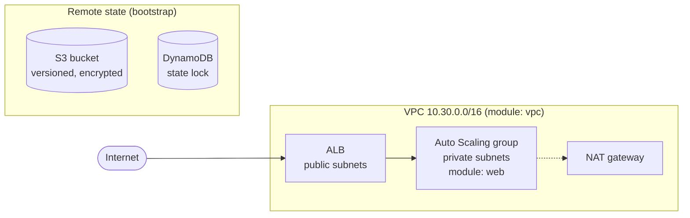

# terraform-aws-infra

A load-balanced, auto-scaling web platform on AWS, built with **reusable Terraform modules**, **S3 remote state with DynamoDB locking**, and **CI checks in GitHub Actions**.


> I'm learning Terraform hands-on. I've built the same kind of platform in CloudFormation before ([aws-cloudformation-vpc-3tier](https://github.com/sukeshavula/aws-cloudformation-vpc-3tier)), and this repo rebuilds it the Terraform way. The "Lessons learned" section below is written from actually running it.

## Architecture



## Layout

```
bootstrap/        one-time: S3 state bucket + DynamoDB lock table (local state)
modules/
  vpc/            VPC, public/private subnets over N AZs, IGW, NAT, routes
  web/            security groups, ALB, launch template, ASG, CPU target tracking
envs/
  dev/            wires the modules together; S3 backend
.github/workflows/terraform.yml   fmt + validate on every push; optional plan on PRs
```

## Why it's structured this way

- **Modules separate the "what" from the "where."** `modules/vpc` and `modules/web` know nothing about dev or prod. Environments pass in sizes and names, so adding `envs/prod` is a short file, not a copy-paste of the whole thing.
- **Remote state with locking.** State lives in a versioned, encrypted S3 bucket, and DynamoDB stops two `apply` runs from corrupting it at the same time. Versioning means a bad state write can be rolled back.
- **The state bucket can't be deleted by accident** (`prevent_destroy`), and it blocks all public access.
- **Subnets are calculated, not hard-coded:** `cidrsubnet()` carves /24s from the VPC CIDR, so changing `az_count` from 2 to 3 just works.
- **One NAT or one per AZ is a single flag** (`nat_per_az`), which makes the cost vs. resilience trade-off explicit.
- **Same security baseline as my CloudFormation work:** chained security groups, no SSH (Session Manager only), IMDSv2 required, encrypted EBS.
- **`default_tags`** on the provider tags every resource with Project, Environment and ManagedBy, so cost reports can be split by environment.

## Run it

Prerequisites: Terraform ≥ 1.6, AWS CLI configured.

**1. Create the state backend (once):**

```bash
cd bootstrap
terraform init
terraform apply -var="state_bucket_name=sukesh-tfstate-$(date +%s)"
```

Copy the bucket name from the output into the `backend "s3"` block in `envs/dev/main.tf`.

**2. Deploy dev:**

```bash
cd ../envs/dev
terraform init
terraform plan -out=dev.tfplan
terraform apply dev.tfplan
terraform output website_url
```

**3. Tear down when finished** (the NAT gateway costs money every hour):

```bash
terraform destroy
```

## CI plan with OIDC (optional)

The `validate` job runs with no AWS access. To also get a `terraform plan` on every pull request without storing AWS keys in GitHub:

1. In IAM, add GitHub as an OIDC identity provider (`token.actions.githubusercontent.com`).
2. Create a role that trusts it for this repo only (`repo:sukeshavula/terraform-aws-infra:*`), with read-only permissions plus access to the state bucket and lock table.
3. Save the role ARN as the repository secret `AWS_PLAN_ROLE_ARN`.

## Lessons learned

*Filled in after deploying. Notes on what broke, what surprised me, and what I'd do differently.*

- …

## Next steps

- `envs/prod` with `nat_per_az = true` and larger instances
- RDS module with Secrets Manager-managed credentials
- `tflint` and `checkov` in CI
